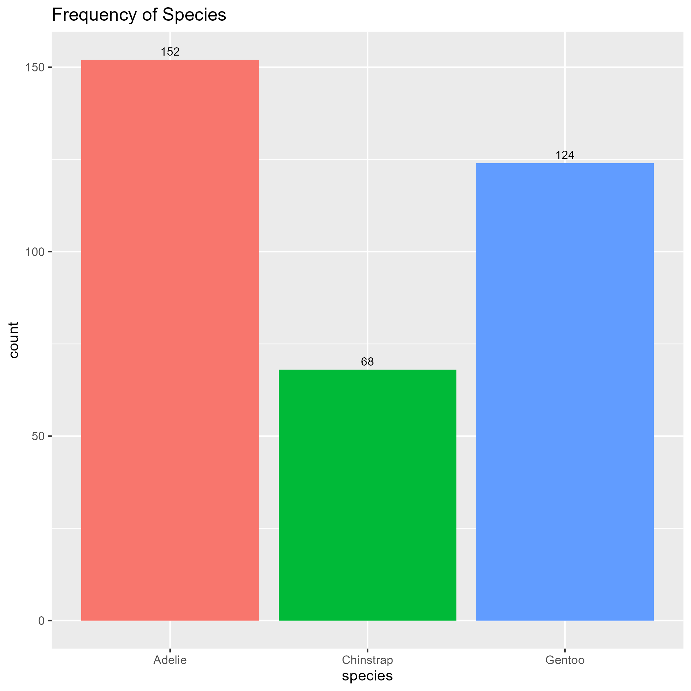
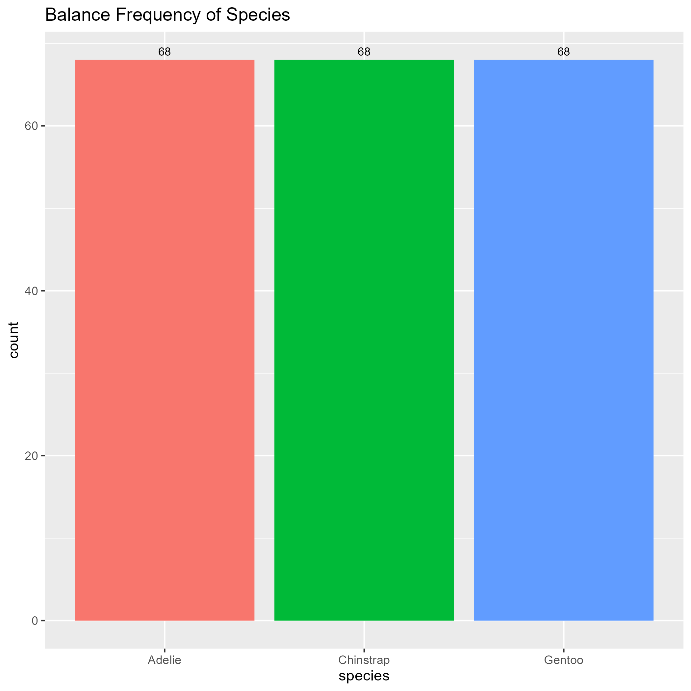
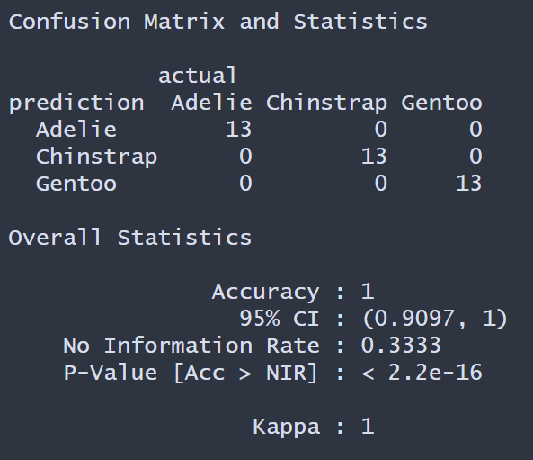

# eXtreme Gradient Boosting on Penguin Species prediction

The data `penguins` is from `palmerpenguins` library. In this project we used  eXtreme Gradient Boosting (XGBoost) to make prediction on type of Species (Adelie, Chinstrap, Gentoo). The data contains 344 observations and 7 predictors. The contains missing values which were ommit for the purpose in this project.

The distribution of frequency `Species` is shown below. Down sampling was performed to make the distribution balanced to reduce bias and increase model performance.

Balance data of `Species`

 

One-hot encoding was performed on categorical variables. Data was split by 80/20 for training and testing data set. Cross validation 5 fold was performed on the training data set for the XGBoost model. Then XGBoost model was predicted on the testing set. The results are shown below.

The XGBoost model performed very well in predicting the accuracy on in the types of Species. We are 95% confident the model accuracy is between .9097 and 1. Adding more data will be beneficial to model performance.
